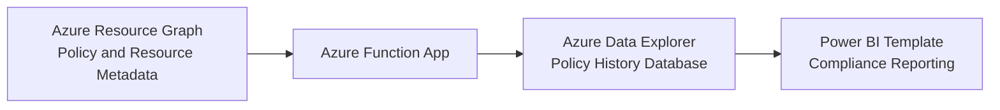

# Azure Policy Compliance History & Drift Analysis

Continuous compliance monitoring for Azure Policy through historical tracking and drift analysis.

Azure Policy provides point-in-time compliance insights, but organisations often lack visibility into how compliance evolves over time. This makes it difficult to measure the impact of remediation efforts, identify compliance drift, and demonstrate governance progress.

This solution addresses that gap by capturing Azure Policy compliance snapshots on a schedule and storing them in Azure Data Explorer (ADX). It enables historical tracking, trend analysis, and drift detection across subscriptions, resource groups, and policy assignments.

A Power BI template is included to visualise compliance trends, policy-level breakdowns, and compliant vs non-compliant resources over time—helping platform and governance teams prioritise actions and report progress with confidence.

This repository provides a reusable, lightweight pattern for implementing continuous compliance monitoring in Azure environments.

## Quick Start

### 1. Deploy to Azure and Download the Power BI Template

| Component | Link |
| :--- | :--- |
| Azure Portal UI |  |
| Power BI Template | |

### 2. Configure Access Scope

Grant the deployed Function App system identity sufficient read access over your target scope (for example, root management group or selected subscriptions/resource groups) so queries can retrieve policy states.

### 3. (Optional) Test Run the Function App to Collect Initial Data

You can trigger the function manually from the Azure Portal to validate data collection and ingestion into ADX before opening the Power BI template.

### 4. Open the Power BI Template

Open `Azure Policy History Report Template.pbit` and configure connection settings to your ADX cluster/database.

## Architecture

## Key Features

- Scheduled ingestion using an Azure Functions timer trigger.
- Centralized storage in ADX for historical analysis.
- Captures:
	- Policy compliance states
	- Resource tags
	- Subscription and management group hierarchy
- Deployable via Azure Portal custom deployment experience or Bicep.
- Sample Power BI template for fast reporting start.

## Prerequisites

- Azure subscription with permissions to deploy resources.
- Permissions to assign required roles for managed identity where needed.
- Power BI Desktop (for the provided `.pbit` template).

## Troubleshooting

- No data in ADX tables:
	- Check Function App run logs.
	- Validate managed identity read access on target scope.
	- Validate `_ADXClusterUri` and `_ADXDatabaseName` settings.
- Power BI connection issues:
	- Validate cluster/database names and authentication.
	- Confirm network and access restrictions.

## Contributing

Contributions are welcome.

- Open an issue to propose changes or report problems.
- Keep infrastructure, function logic, and reporting changes scoped and documented.
- Include validation steps in pull requests.
